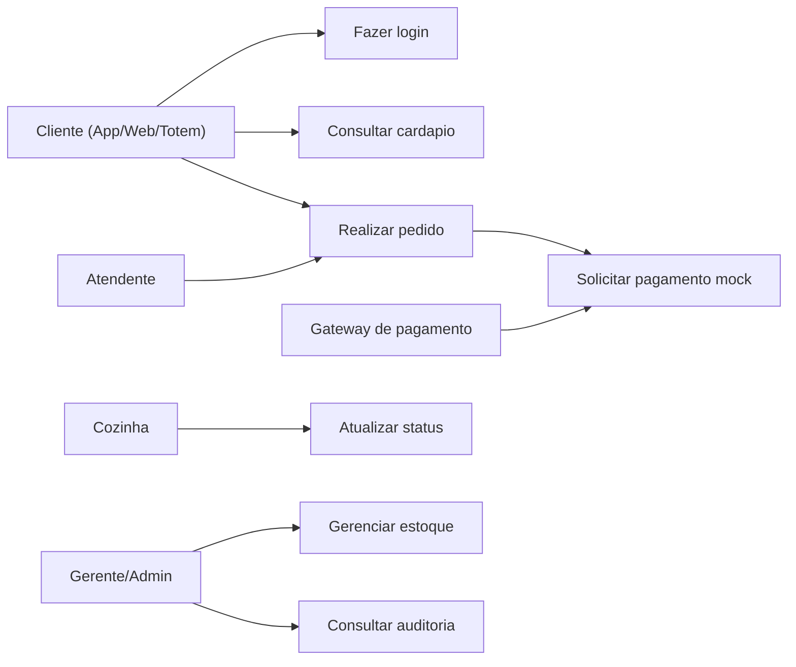
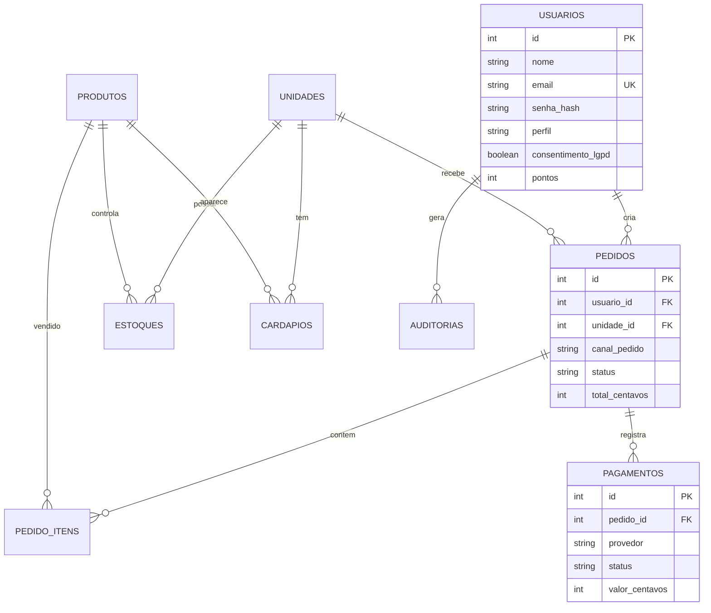
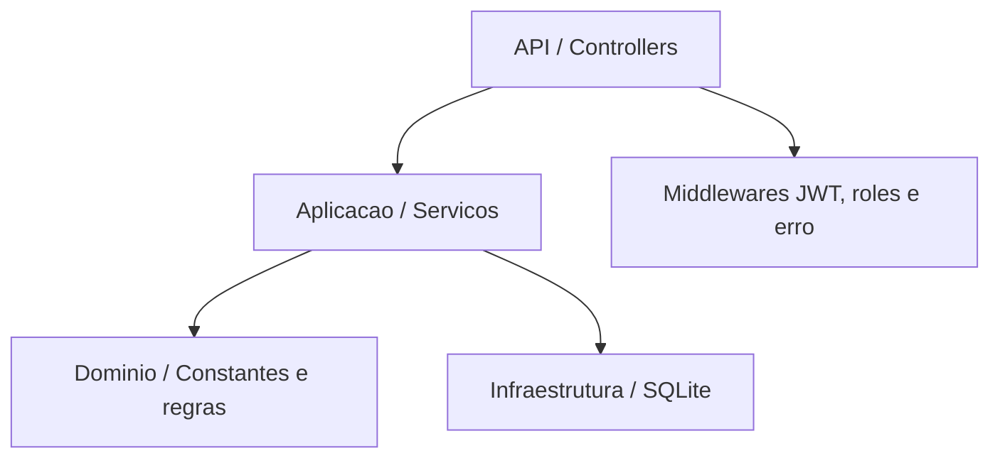
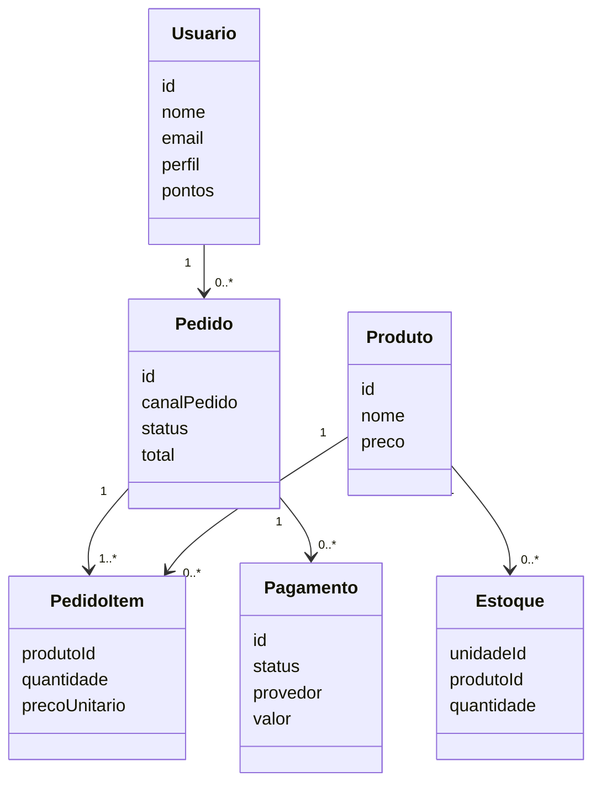
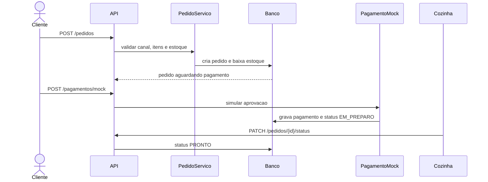

# Projeto Back-end - Rede Raizes do Nordeste

Aluno: preencher nome e RU  
Curso: Projeto Multidisciplinar - Trilha Back-end  
Ano: 2026

## 1. Introducao

O projeto simula o back-end de uma rede de lanchonetes chamada Raizes do Nordeste. A solucao atende pedidos vindos de varios canais, como APP, TOTEM, BALCAO, PICKUP e WEB.

O MVP implementado foi o fluxo A do roteiro: **Pedido -> Pagamento mock -> Atualizacao de status**. Tambem foram incluidos cadastro/login, estoque, fidelidade simples, auditoria e Swagger.

## 2. Requisitos

### Requisitos funcionais

| ID | Requisito | Situacao |
| --- | --- | --- |
| RF01 | Cadastro e login de usuarios | Implementado |
| RF02 | Perfis/roles de acesso | Implementado |
| RF03 | Consulta de unidades e cardapio por unidade | Implementado |
| RF04 | Criacao de pedido com itens, valores e status | Implementado |
| RF05 | Campo `canalPedido` obrigatorio | Implementado |
| RF06 | Filtro de pedidos por `canalPedido` | Implementado |
| RF07 | Controle de estoque por unidade | Implementado |
| RF08 | Pagamento externo mock aprovado/recusado | Implementado |
| RF09 | Fidelidade com pontos | Implementado simples |
| RF10 | Promocoes/campanhas | Descrito como melhoria futura |

### Requisitos nao funcionais

| ID | Requisito | Como foi tratado |
| --- | --- | --- |
| RNF01 | Seguranca | JWT, hash de senha e roles |
| RNF02 | LGPD | Consentimento e nao exposicao de senha |
| RNF03 | Auditoria | Tabela `auditorias` |
| RNF04 | Documentacao | Swagger/OpenAPI e README |
| RNF05 | Persistencia | SQLite com migrations e seed |
| RNF06 | Tolerancia a falha no pagamento | Mock retorna aprovado ou recusado |

## 3. Priorizacao

Foi priorizado o fluxo principal porque ele fecha o funcionamento minimo exigido. O sistema valida estoque, cria o pedido, registra pagamento mock e muda o status. Campanhas ficaram como proposta, pois nao eram necessarias para provar o fluxo minimo.

## 4. Casos de uso



### UC01 - Realizar pedido e pagamento

Ator principal: Cliente ou Atendente.  
Pre-condicao: usuario autenticado e produto com estoque.  
Fluxo principal: usuario informa unidade, canal, itens e forma de pagamento; API valida estoque; cria pedido; pagamento mock aprova; pedido vai para `EM_PREPARO`; cozinha muda para `PRONTO` e depois `ENTREGUE`.  
Excecoes: sem token retorna 401; sem permissao retorna 403; estoque insuficiente retorna 409; canal invalido retorna 422; pagamento recusado deixa o pedido como `PAGAMENTO_RECUSADO`.

## 5. DER



## 6. Arquitetura



Separacao usada:

- `api`: rotas, controllers, middlewares e OpenAPI.
- `aplicacao`: regras de pedido, pagamento, estoque, auth e fidelidade.
- `dominio`: enums e constantes do dominio.
- `infraestrutura`: SQLite e migrations.

## 7. Diagrama de classes



## 8. Sequencia do fluxo critico



## 9. Endpoints principais

| Recurso | Metodo e rota | Permissao | Resumo |
| --- | --- | --- | --- |
| Auth | `POST /auth/cadastro` | Publico | Cadastro de cliente |
| Auth | `POST /auth/login` | Publico | Login com JWT |
| Usuarios | `GET /usuarios/me` | JWT | Perfil logado |
| Unidades | `GET /unidades` | Publico | Lista unidades |
| Cardapio | `GET /unidades/{id}/cardapio` | Publico | Cardapio por unidade |
| Produtos | `GET /produtos` | JWT | Lista produtos |
| Produtos | `POST /produtos` | GERENTE/ADMIN | Cria produto |
| Estoque | `GET /estoque` | GERENTE/ADMIN/COZINHA | Consulta saldo |
| Estoque | `POST /estoque/movimentos` | GERENTE/ADMIN | Entrada/saida |
| Pedidos | `POST /pedidos` | CLIENTE/ATENDENTE | Cria pedido |
| Pedidos | `GET /pedidos` | JWT | Lista com filtros |
| Pedidos | `PATCH /pedidos/{id}/status` | COZINHA/GERENTE/ADMIN | Atualiza status |
| Pagamentos | `POST /pagamentos/mock` | JWT | Simula pagamento |
| Fidelidade | `GET /fidelidade/saldo` | CLIENTE | Consulta pontos |
| Auditoria | `GET /auditorias` | GERENTE/ADMIN | Lista logs |

Padrao de erro:

```json
{
  "error": "VALIDACAO_ERRO",
  "message": "Mensagem legivel",
  "details": [
    { "field": "canalPedido", "issue": "Valor nao permitido." }
  ],
  "timestamp": "2026-02-05T12:00:00.000Z",
  "path": "/pedidos"
}
```

## 10. LGPD e seguranca

Dados pessoais coletados: nome, e-mail e senha. A senha nao fica em texto puro, apenas hash. O e-mail e nome sao usados para autenticacao e identificacao do cliente nos pedidos.

O consentimento LGPD fica salvo no campo `consentimento_lgpd`. As respostas nao retornam `senha_hash`. Endpoints administrativos exigem perfil, e a tabela de auditoria registra acoes sensiveis.

## 11. Plano de testes

| ID | Cenario | Endpoint | Pre-condicao | Entrada | Esperado | Evidencia |
| --- | --- | --- | --- | --- | --- | --- |
| T01 | Login cliente valido | `POST /auth/login` | Seed aplicado | email/senha | 200 + token | Auth/Login cliente |
| T02 | Login admin valido | `POST /auth/login` | Seed aplicado | email/senha | 200 + token | Auth/Login admin |
| T03 | Listar cardapio | `GET /unidades/1/cardapio` | Seed aplicado | unidade 1 | 200 + produtos | Catalogo/Cardapio |
| T04 | Criar pedido valido | `POST /pedidos` | Cliente logado | canal TOTEM + item | 201 + AGUARDANDO_PAGAMENTO | Pedidos/Criar pedido valido |
| T05 | Pagamento aprovado | `POST /pagamentos/mock` | Pedido criado | aprovado true | 201 + APROVADO | Pagamentos/Aprovar pagamento |
| T06 | Atualizar para pronto | `PATCH /pedidos/{id}/status` | Cozinha logada | status PRONTO | 200 + PRONTO | Pedidos/Atualizar status |
| T07 | Filtrar por canal | `GET /pedidos?canalPedido=TOTEM` | Cliente logado | query | 200 + pedidos | Pedidos/Listar por canal |
| T08 | Consultar fidelidade | `GET /fidelidade/saldo` | Cliente logado | token | 200 + pontos | Fidelidade/Saldo |
| T09 | Sem token | `GET /pedidos` | Nenhuma | sem auth | 401 | Erros/Listar pedidos sem token |
| T10 | Perfil sem permissao | `POST /produtos` | Cliente logado | produto | 403 | Erros/Cliente cria produto |
| T11 | Canal ausente | `POST /pedidos` | Cliente logado | sem canalPedido | 422 | Erros/Pedido sem canal |
| T12 | Estoque insuficiente | `POST /pedidos` | Cliente logado | qtd 9999 | 409 | Erros/Estoque insuficiente |
| T13 | Produto inexistente | `POST /pedidos` | Cliente logado | produto 999 | 404 | Erros/Produto inexistente |
| T14 | Auditoria | `GET /auditorias` | Admin logado | token admin | 200 + logs | Auditoria/Listar logs |

## 12. Conclusao

O projeto entrega o MVP exigido com persistencia real, JWT, roles, Swagger, Postman e fluxo de pedido com pagamento mock. O campo `canalPedido` aparece no contrato e nos filtros, permitindo rastrear a origem do pedido.

Como melhoria futura, seriam adicionadas campanhas promocionais mais completas, deploy em nuvem e testes automatizados alem da colecao Postman.

## 13. Referencias

- Documentacao Node.js
- Documentacao Express
- Documentacao Swagger/OpenAPI
- Lei Geral de Protecao de Dados Pessoais (LGPD)

